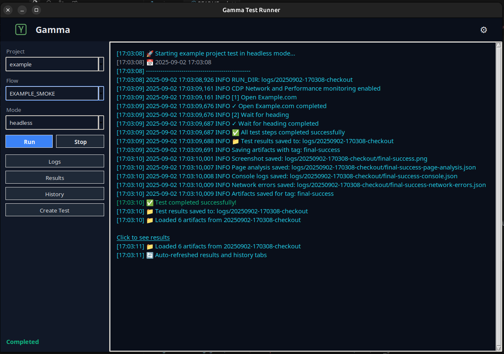

# Gamma - E2E Test Automation Tool



Multi-project e-commerce test automation tool built with Selenium and Python GUI.

## 🚀 Features

- **Modern GUI**: Dark theme with intuitive controls (no coding required)
- **Multi-project Support**: Google, Example, and more
- **Headless & Normal Mode**: Run tests with or without browser UI
- **JSON Test Flows**: Create tests without coding
- **Artifact Collection**: Screenshots, logs, and analysis on failures
- **Test Builder**: Visual test creation interface
- **Cross-platform**: Windows, macOS, Linux
 - **Settings Panel**: Per‑project Email/Password/User‑Agent, normal mode window size and DevTools toggle; changes apply without restart

## 📁 Project Structure

```
gamma/
├── 📁 assets/           # Icons and images
├── 📁 config/           # Theme configuration
├── 📁 tests/            # Test framework
│   ├── projects/        # Project-specific test folders
│   │   ├── GOOGLE/      # Google project tests
│   │   ├── EXAMPLE/     # Example project tests
│   │   └── NEW_PROJECT/ # Your new project tests
│   ├── base_test_engine.py  # Core test engine
│   └── json_runner.py   # JSON flow executor
├── gui.py               # Main GUI application
├── run_gui.py           # GUI launcher
└── requirements_gui.txt  # Python dependencies
```

## 🎯 Quick Start

### 1. Setup Environment (no Python knowledge needed)

```bash
# Clone and setup
git clone <your-repo>
cd gamma

# Install dependencies
pip install -r requirements_gui.txt

# Optional: Create .env (if you want to preload emails/passwords/UA). If you skip this step, you can set them later from Settings.
cp env.example .env  # optional
```

### 2. Configure Projects

Option A) Edit `.env` with your project credentials (recommended for CI):

```bash
# Google Project
GOOGLE_EMAIL=your_email@gmail.com
GOOGLE_PASSWORD=your_password

# Example Project  
EXAMPLE_EMAIL=test@example.com
EXAMPLE_PASSWORD=test123

# Add more projects as needed
NEW_PROJECT_EMAIL=user@newproject.com
NEW_PROJECT_PASSWORD=password123
```

Option B) Use the GUI Settings tab to set Email/Password/User‑Agent and Browser options (applies immediately).

### 3. Run Tests

```bash
# Start GUI
python run_gui.py

# Or run specific test
python tests/json_runner.py tests/projects/google/GOOGLE_HOMEPAGE.json GOOGLE
```

## 🧪 Creating Tests

### Option 1: GUI Create Test (Recommended)

1. Launch GUI → "Create Test" tab
2. Select project from dropdown
3. Add steps: navigate, click, fill, wait
4. Save flow → automatically discovered by GUI

### Option 2: JSON Files (Manual Creation)

Place `tests/projects/<PROJECT>/<FLOW>.json`:

```json
{
  "PROJECT_CONFIG": { "name": "MY_SHOP" },
  "TEST_STEPS": [
    {
      "name": "Go to homepage",
      "action": "navigate",
      "url": "https://myshop.com"
    },
    {
      "name": "Wait for search",
      "action": "wait", 
      "selector": "#search-input",
      "timeout": 20
    },
    {
      "name": "Fill email",
      "action": "fill",
      "selector": "#email",
      "value": "$EMAIL"
    },
    {
      "name": "Fill password", 
      "action": "fill",
      "selector": "#password",
      "value": "$PASSWORD"
    }
  ]
}
```

**Special Tokens:**
- `$EMAIL` → automatically replaced with `<PROJECT>_EMAIL` from `.env`
- `$PASSWORD` → automatically replaced with `<PROJECT>_PASSWORD` from `.env`

**Supported Actions:**
- `navigate`: Go to URL
- `click`: Click element
- `fill`: Fill input field  
- `wait`: Wait for element

### Option 3: Python Scripts (Advanced)

Put a `*.py` under `tests/projects/<PROJECT>/` using the shared engine.

## 🔧 Configuration

### Environment Variables

```bash
# Project credentials (required)
<PROJECT>_EMAIL=user@project.com
<PROJECT>_PASSWORD=password123

# Optional settings
LOGS_MAX_RUNS=10                 # Keep only latest N test runs
# Per project creds (loaded automatically): <PROJECT>_EMAIL / <PROJECT>_PASSWORD / <PROJECT>_USER_AGENT
# Browser (normal mode): BROWSER_WIDTH / BROWSER_HEIGHT / DEVTOOLS_OPEN (0/1)
```

### Theme Configuration

Edit `config/theme_config.json` to customize colors and styling.

## 🚀 Advanced Usage

### Headless Mode

Perfect for CI/CD pipelines:

```bash
# Set environment
export HEADLESS=1

# Run test
python tests/json_runner.py tests/projects/google/GOOGLE_HOMEPAGE.json GOOGLE
```

### Custom User Agents

```bash
# In .env
GOOGLE_USER_AGENT="Mozilla/5.0 (Windows NT 10.0; Win64; x64) AppleWebKit/537.36"
```

### Test Artifacts

Failed tests automatically save:
- Screenshots at failure points
- Console error logs
- Network error summaries  
- Page analysis data
- Full test logs

## 🆕 Adding New Project / Flow

### Quick Method (GUI)

1. Launch GUI → "Test Builder" tab
2. Select project from dropdown
3. Add test steps
4. Save flow → automatically discovered

### Manual Method

1. Create folder: `tests/projects/<PROJECT>/`
2. Add `<FLOW>.json` with `PROJECT_CONFIG` and `TEST_STEPS`
3. Optionally add to `.env`: `<PROJECT>_EMAIL`, `<PROJECT>_PASSWORD`, `<PROJECT>_USER_AGENT`
4. Or set them via GUI → Settings; Start GUI → select Project and Flow → Run

### Python Method

1. Create `tests/projects/<PROJECT>/<FLOW>.py`
2. Import `BaseTestEngine` and define `TEST_STEPS`
3. Run directly or via GUI

## 🐛 Troubleshooting

### Common Issues

- **Element not found**: Check selector, timing, iframes
- **Headless failures**: Verify window size, scale factor  
- **Screenshot issues**: Check file permissions, disk space
- **Import errors**: Verify `sys.path.append` and `__init__.py` files

### Debug / Verbosity

Enable detailed logging:

```bash
Use the GUI Logs tab for details; you can also increase Selenium/console verbosity via environment if needed.

## 🧭 Tips for non‑developers

- Use Settings to enter Email/Password/User‑Agent; values apply instantly, no restart needed.
- Normal mode browser size and DevTools can be set from Settings.
- When a test finishes, the Logs tab shows a “Click to see results” link.
- You can clear all logs from the History tab.
```

### Test Builder Issues

- **Test Builder not working**: Ensure you have write permissions to `tests/projects/` folder
- **Steps not saving**: Check project name and flow name are filled
- **Validation errors**: Ensure required fields are completed

## 📊 Test Results

Test results are saved in `logs/<timestamp>-<testtype>/`:

- `summary.json`: Test execution summary
- `*.png`: Screenshots at failure points
- `*-page-analysis.json`: Page state analysis
- `*-console.json`: Console error logs
- `*-network-summary.json`: Network request summary

## 🤝 Contributing

1. Fork the repository
2. Create feature branch
3. Add tests for new functionality
4. Submit pull request

## 📄 License

This project is licensed under the MIT License - see the LICENSE file for details.

---

**Happy Testing! 🎉**
